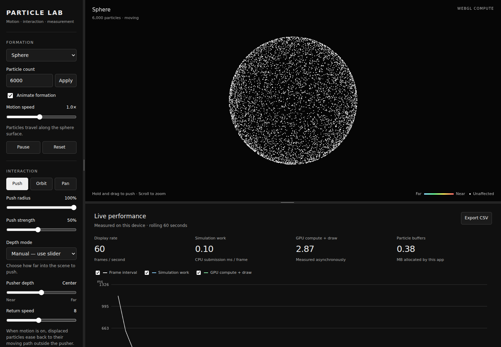

# Particle Lab

An interactive 3D particle motion lab with GPU-capable updates, a CPU reference,
and a trained local-dynamics model evaluated alongside the simulation.

The interface keeps controls on the left and the simulation at the top and right
edges. Only the information panel beneath the simulation scrolls. Both dividers
are resizable. The menus are black with white controls; color is reserved for
local pusher influence and timing series.



## Run locally

Use Python 3.10+ and a modern desktop browser:

```sh
python app.py
```

On Windows, double-click `START_WINDOWS.bat`, or run `py -3 app.py`.
The app opens at `http://127.0.0.1:8765`. Keep the terminal open; Ctrl+C stops it.
**No runtime packages or external services are required.** Read `START_HERE.txt`
for a step-by-step Windows guide. `--port 8766` selects another local port.

## Interaction

| Control | Behavior |
| --- | --- |
| Sphere | Particles circulate on a spherical surface. |
| Cube | Particles move freely on reflected paths inside a box. |
| Ring | Particles circulate around a thin torus. |
| Helix | Particles move along the helix and turn back at its ends. |
| Animate formation | Starts or stops shape-path motion and enables recovery. |
| Push | Hold and drag to displace nearby particles. |
| Depth mode | Choose Manual slider depth or Auto targeting of particles under the cursor. |
| Pusher depth | In Manual mode, moves the tool through the scene's third dimension. |
| Push radius | Changes the affected 3D region; its projected indicator stays compact. |
| Return speed | Controls how displaced particles recover outside the pusher while moving. |
| Orbit and Pan | Rotate or reposition the camera. The mouse wheel zooms. |
| Pause | Freezes the engine. Camera and menus remain usable. Space is a shortcut. |

Unaffected particles are white. Inside the tool, distance maps from light blue
through green and yellow to light red nearest the tool. The brush outline is
white. Hover previews the affected region; holding applies force. Auto depth targets the
frontmost displaced particles within 10 screen pixels of the cursor. Empty space
has no target. Manual mode preserves its slider value when you switch modes.

## What makes this a software project

- **Graphics-buffer state updates:** WebGL 2 transform feedback runs the update
  kernel over particle offsets and velocities. Two buffers alternate as input
  and output, avoiding a full CPU readback on each frame.
- **A reference implementation:** JavaScript implements the same shape paths
  and fixed-step dynamics for verification and a CPU fallback.
- **A trained surrogate:** Python generates synthetic local-dynamics data and
  trains an 11 → 48 → 48 → 3 neural network. Its weights ship as JSON and run
  locally in the browser. The live feed compares sampled predictions against
  the next engine state.
- **Measured telemetry:** a wide timing chart, optional asynchronous GPU queries,
  CSV export, setup import/export, and browser-local experiment history.
- **Stability and testing:** bounded displacement and velocity, fixed 1/60-second
  steps, capped catch-up work, background-tab handling, and numerical tests.

Python handles the local server and model training. JavaScript handles the UI
and reference engine. GLSL handles the graphics-buffer update and rendering.
The model is a learned approximation of local displacement dynamics; it is not
a chatbot and does not generate explanations of hardware behavior.

## Measurements

The large chart comes first in the scroll panel. Model status and the comparison
stream sit side by side below it on desktop, then stack on narrow screens.

- **Display rate:** delivered animation frames per second.
- **Simulation work:** CPU time spent calling update steps, or CPU reference
  computation time. Submission time is **not** GPU execution time.
- **GPU compute + draw:** asynchronous elapsed queries when supported, excluding
  diagnostic readback and model-comparison frames. Missing readings stay blank.
- **Particle buffers:** bytes explicitly allocated for particle data, not total
  device memory usage.
- **Model error:** sampled next-step position RMSE in scene units, accompanied
  by the time needed to compute those predictions.

The browser may use a hardware or software graphics backend. The app does not
claim to detect hardware identity. It is a workload lab, not a calibrated
hardware benchmarking suite. Model comparison reads a small sample of state;
this can add synchronization cost. Auto depth also reads particle state up to
10 times per second while hovering; its readback and selection cost appears as
`depth_pick_ms` in CSV exports and contributes to frame time. The graph uses real samples rather than
sample curves or estimated numbers.

## Scope and limitations

This version uses kinematic shape paths plus a damped displacement response.
It does not implement particle-particle collisions, a fluid solver, or a
scientifically calibrated material model. Particles return to their original
**moving path**, not a frozen point, when formation motion is enabled.

The first release supports 300–50,000 particles in graphics mode and up to
10,000 in CPU mode. Actual smoothness depends on the device. Training does not
guarantee bug-free operation; the learned model never drives visible motion.

## Source layout

```text
app.py                    Local Python launcher and static server
web/index.html            Interface structure
web/style.css             Black and white layout and resize regions
web/app.js                Controls, timing, exports, and live model comparison
web/core.js               Deterministic paths, CPU dynamics, model inference
web/engine.js             Graphics shaders, state buffers, CPU renderer
web/models/               Trained weights and evaluation report
training/train_model.py   Reproducible Python training script
training/requirements.txt Optional training dependencies
tests/                    Numerical and browser integration checks
docs/                     Model card and validation results
```

## Train again only if you want to experiment

The released model is already trained. Retraining requires optional packages:

```sh
python -m venv .venv
# Windows: .venv\Scripts\activate
# macOS/Linux: source .venv/bin/activate
python -m pip install -r training/requirements.txt
python training/train_model.py
```

A candidate must pass the training script's quality gates before it replaces
the model file. The script uses independent evaluation seeds and reports a
short recovery rollout. See `docs/MODEL_CARD.md` for the method and limitations.

## Verify

With Node.js installed, numerical tests require no npm packages:

```sh
node --test tests/core.test.js
```

Optional browser checks require Playwright and its test browser:

```sh
npm install --no-save playwright
npx playwright install chromium
node tests/browser_check.cjs
```

Set `PARTICLE_PYTHON` if your Python command is not `python`. The browser test
starts its own local server on a free port and cleans it up afterward.
See `docs/VALIDATION.md` for release validation and its limits.

## Technical references

- [WebGL transform feedback](https://developer.mozilla.org/en-US/docs/Web/API/WebGL2RenderingContext/transformFeedbackVaryings)
- [MLPRegressor](https://scikit-learn.org/stable/modules/generated/sklearn.neural_network.MLPRegressor.html)
- [Python HTTP server](https://docs.python.org/3/library/http.server.html)

No external network requests are needed during normal app use. The server binds
only to the local loopback address. Browser-local histories stay on that browser.
